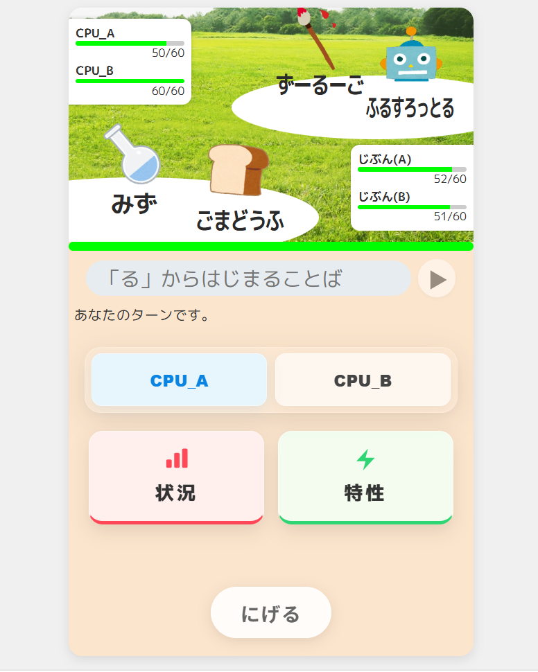

# しりとりの対戦バトル

オンラインでリアルタイム対戦ができるしりとりゲームです。
言葉に割り当てられた「タイプ」の相性を読みながら戦います。
https://shiritorinodui-zhan-batoru.onrender.com

> Inspired by [しりとりバトル](http://siritori-battle.net/)
>
> 本プロジェクトは、既存のWebゲーム『しりとりバトル』のバトルシステムにインスパイアされて開発した個人制作の Web アプリです。
> 画像素材にはいらすとや等のフリー素材を使用しており、非営利目的です。

## スクリーンショット

| タイトル画面 | バトル画面 |
|:---:|:---:|
|  |  |

## 主な機能

- **リアルタイム対戦** — WebSocket による常時接続で、ランダムマッチ・合言葉マッチ・CPU 対戦に対応
- **ゲームモードの拡張** — ダブルバトル / ストック制（複数残機）
- **AI による辞書構築** — Gemini 3 Flash を活用して約 16,000 語のタイプを自動分類

## 使用技術

| レイヤー | 技術 |
|---|---|
| Frontend | React 19, TypeScript, Vite|
| Backend | Python 3.11, FastAPI, WebSocket |
| データ | SQLite3（約 250 万語の辞書 + 約 16,000 語のタイプ付き辞書） |
| テスト | pytest |
| デプロイ | Render |

## セットアップ

### バックエンド

```bash
python -m venv venv
.\venv\Scripts\activate        # Windows
# source venv/bin/activate     # macOS / Linux

pip install -r requirements.txt
uvicorn backend.main:app --reload
```

初回起動時に辞書 DB が自動構築されます。

### フロントエンド

```bash
cd frontend-v2
npm install
npm run dev
```

`http://localhost:5173` にアクセスするとプレイできます。

### テスト

```bash
.\venv\Scripts\python -m pytest
```
